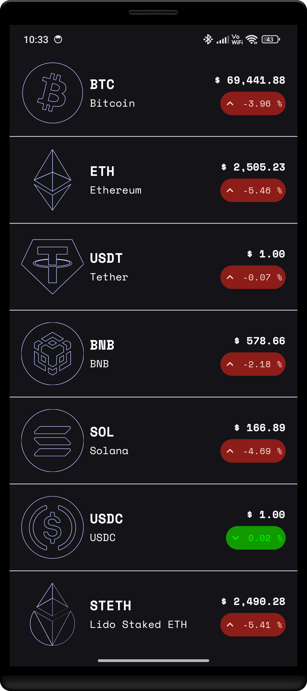
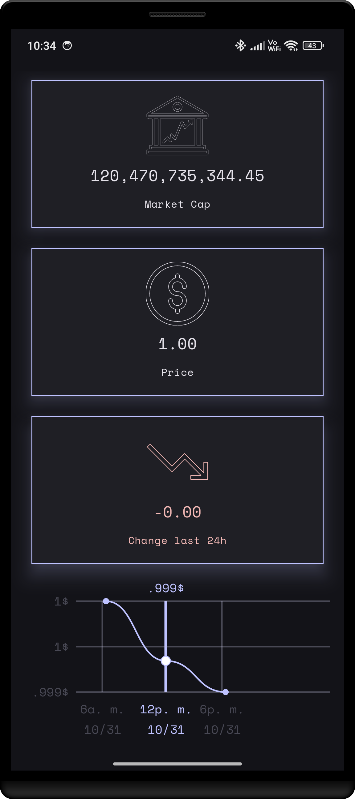
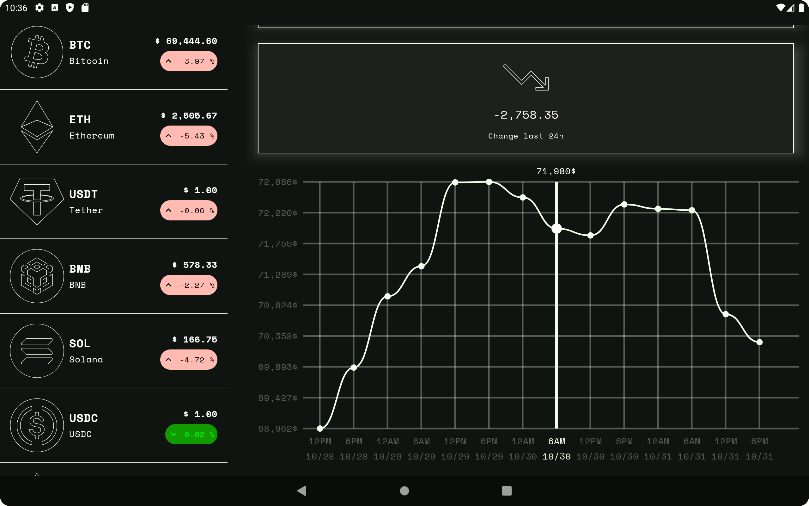
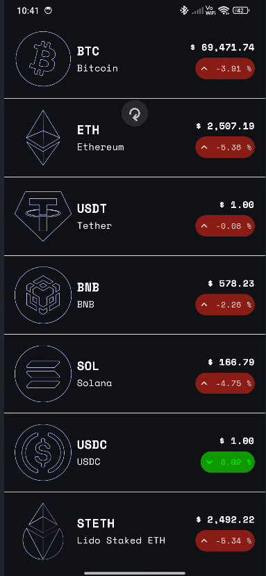

# Crypto Tracker

Android project that fetch a list of coins and its details from a crypto currency API. It uses
Ktor as a client, Jetpack Compose with adaptive layout and Kotlin.

---

# Getting Started

Prerequisites:
* Android Studio Koala 2024.1.1
* 
Installation:
* Compile the app with Android Studio
* Run it with an AVD or a physical device

---

# Architecture

Use clean architecture layer:

* core package is for common helpers to use in all the project.
* crypto package implement the logic to fetch coin list using ktor in the data layer. The
domain layer implements some models that differ from dto's and specific mappers.
The presentation layer contains different views with an associated viewmodel that handles the
application state.
* di package and the application class are used to provide and resolve dependencies to the
whole app.

Tech stack:

* Android SDK 35
* Kotlin
* Jetpack Compose
* Koin
* Ktor
* Material 3, adaptive Navigation, pull to refresh box.
* Jetpack Compose Canvas API

---

# Usage

Basically consist of two screens that have a `navigator` used with `NavigableListDetailPaneScaffold`
component to create an adaptive layout and navigate between the _list pane_ and the _detail pane_.
The list pane shows a list of crypto coins with some data, as shown below:

The detail pane shows the details of the coin in a `FlowRow` and a history coin price change in a
line path graph created using Canvas API.

As we are using `NavigableListDetailPaneScaffold` it is possible to show both screens when there are
enough space available.

It is implemented a pull to refresh action to get the latest coins list and coin price change
history.

